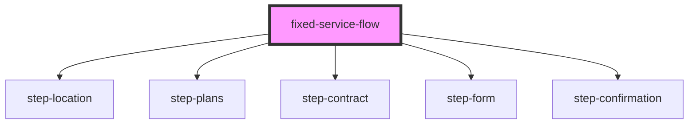

# fixed-service-flow

<!-- Auto Generated Below -->

## Properties

| Property                     | Attribute         | Description                          | Type                    | Default     |
| ---------------------------- | ----------------- | ------------------------------------ | ----------------------- | ----------- |
| `apiUrl` _(required)_        | `api-url`         | Base URL for the API                 | `string`                | `undefined` |
| `correlationId`              | `correlation-id`  | Optional correlation ID for tracking | `string`                | `undefined` |
| `debug`                      | `debug`           | Debug mode                           | `boolean`               | `false`     |
| `googleMapsKey` _(required)_ | `google-maps-key` | Google Maps API Key                  | `string`                | `undefined` |
| `initialStep`                | `initial-step`    | Initial step (default: 1)            | `1 \| 2 \| 3 \| 4 \| 5` | `1`         |

## Events

| Event          | Description                                  | Type                             |
| -------------- | -------------------------------------------- | -------------------------------- |
| `flowCancel`   | Emitted when user cancels the flow           | `CustomEvent<void>`              |
| `flowComplete` | Emitted when the flow completes successfully | `CustomEvent<FlowCompleteEvent>` |
| `flowError`    | Emitted when an error occurs                 | `CustomEvent<FlowErrorEvent>`    |
| `stepChange`   | Emitted when step changes                    | `CustomEvent<StepChangeEvent>`   |

## Dependencies

### Depends on

- [step-location](../steps/step-location)
- [step-plans](../steps/step-plans)
- [step-contract](../steps/step-contract)
- [step-form](../steps/step-form)
- [step-confirmation](../steps/step-confirmation)

### Graph

----------------------------------------------

*Built with [StencilJS](https://stenciljs.com/)*
