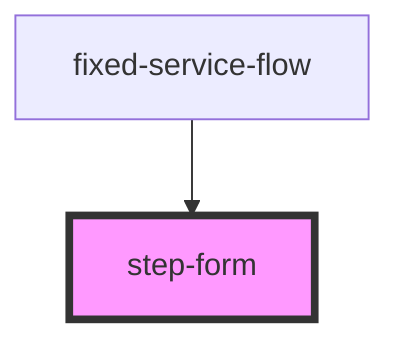

# step-form

<!-- Auto Generated Below -->

## Properties

| Property | Attribute | Description | Type         | Default     |
| -------- | --------- | ----------- | ------------ | ----------- |
| `onBack` | --        |             | `() => void` | `undefined` |
| `onNext` | --        |             | `() => void` | `undefined` |

## Dependencies

### Used by

 - [fixed-service-flow](../../fixed-service-flow)

### Graph

----------------------------------------------

*Built with [StencilJS](https://stenciljs.com/)*
