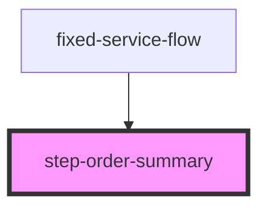

# step-order-summary

## Description

Order summary component for CLARO HOGAR e-commerce flow. Displays cart items, allows promo code application, shows payment breakdown, and handles terms acceptance before proceeding to shipping.

## Features

- Cart items display with images, details, and pricing
- Remove item functionality
- Promo code input and validation
- Payment breakdown (subtotal, tax, down payment, total, monthly)
- Terms and conditions checkbox
- Empty cart state handling
- Loading and error states
- Responsive grid layout

## Usage

```html
<step-order-summary
  onNext={() => goToShipping()}
  onBack={() => goToPlans()}
></step-order-summary>
```

## Props

| Property | Type | Description |
|----------|------|-------------|
| `onNext` | `() => void` | Callback when user accepts terms and proceeds |
| `onBack` | `() => void` | Callback to return to previous step |

## Flow

1. Component loads cart from cartService.getCart()
2. Displays cart items with remove option
3. User can apply promo code (optional)
4. User must accept terms and conditions
5. User clicks "Procesar orden" to proceed to shipping

## Session Storage Keys

- `mainId` - Cart ID (used by cartService)
- `discountCoupon` - Applied promo code (if any)

## API Endpoints Used

- `POST api/Card/getCart` - Get cart contents
- `DELETE api/Card/deleteItem` - Remove item from cart

## States

| State | Description |
|-------|-------------|
| `isLoading` | Cart data is being fetched |
| `error` | Error message if cart load fails |
| `cart` | CartResponse object with products and totals |
| `promoCode` | Current promo code input |
| `promoSuccess` | Whether promo was applied successfully |
| `termsAccepted` | Whether user accepted terms |

<!-- Auto Generated Below -->


## Properties

| Property | Attribute | Description | Type         | Default     |
| -------- | --------- | ----------- | ------------ | ----------- |
| `onBack` | --        |             | `() => void` | `undefined` |
| `onNext` | --        |             | `() => void` | `undefined` |


## Dependencies

### Used by

 - [fixed-service-flow](../../fixed-service-flow)

### Graph


----------------------------------------------

*Built with [StencilJS](https://stenciljs.com/)*
