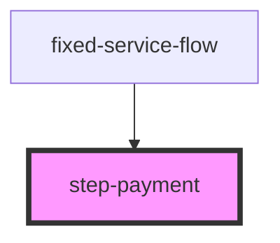

# step-payment

## Description

Payment processing component for CLARO HOGAR e-commerce flow. Handles order creation and integrates with the external payment iframe for secure card processing.

## Features

- Order creation before payment
- External payment iframe integration
- Multiple payment items support (deposit, down payment, taxes, installments)
- Payment result handling (success/error)
- Free purchase handling (zero amount)
- Loading and processing states
- Automatic redirect on success

## Usage

```html
<step-payment
  onNext={() => goToConfirmation()}
  onBack={() => goToShipping()}
></step-payment>
```

## Props

| Property | Type | Description |
|----------|------|-------------|
| `onNext` | `() => void` | Callback when payment is successful |
| `onBack` | `() => void` | Callback to return to shipping |
| `paymentIframeUrl` | `string` (optional) | External payment iframe URL |

## Flow

1. Component loads cart data
2. Builds payment items from cart (deposit, taxes, etc.)
3. Creates order via `api/Orders/creationOfOrder`
4. Initializes payment iframe via `api/Payment/getIframe`
5. Listens for iframe postMessage events
6. On success: records payment via `api/Payment/record`
7. Redirects to confirmation

## Payment Screens

| Screen | Description |
|--------|-------------|
| `loading` | Loading cart data |
| `creating-order` | Creating order in backend |
| `payment` | Payment iframe displayed |
| `processing` | Recording payment result |
| `success` | Payment successful |
| `error` | Error occurred |

## Payment Items

The component supports multiple payment types:
- `DEPOSIT`: Security deposit
- `DOWNPAYMENT`: Down payment for equipment
- `TAXES`: Tax amount
- `INSTALLMENT`: Installment payments
- `PASTDUEONLY`: Past due balance

## API Endpoints Used

- `POST api/Orders/creationOfOrder` - Create order before payment
- `POST api/Payment/getIframe` - Get payment iframe URL
- `POST api/Payment/record` - Record successful payment
- `POST api/Payment/error` - Record payment error

## Iframe Communication

The component listens for postMessage events from the payment iframe:

```javascript
// Message format (Base64 encoded JSON)
{
  state: 'dimensions' | 'start' | 'canceled' | 'paymentResult',
  data: { ... }
}
```

## Session Storage Keys

- `orderBan` - Order BAN (billing account number)
- `paymentResult` - Payment result object

<!-- Auto Generated Below -->


## Properties

| Property           | Attribute            | Description | Type         | Default     |
| ------------------ | -------------------- | ----------- | ------------ | ----------- |
| `onBack`           | --                   |             | `() => void` | `undefined` |
| `onNext`           | --                   |             | `() => void` | `undefined` |
| `paymentIframeUrl` | `payment-iframe-url` |             | `string`     | `undefined` |


## Dependencies

### Used by

 - [fixed-service-flow](../../fixed-service-flow)

### Graph


----------------------------------------------

*Built with [StencilJS](https://stenciljs.com/)*
