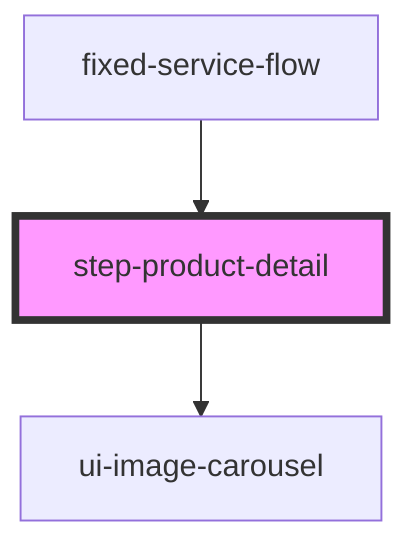

# step-product-detail

## Description

Product detail view component for CLARO HOGAR e-commerce flow. Displays detailed product information including images, colors, storage options, installment plans, and quantity selection.

## Features

- Product image display
- Color selection with visual circles
- Storage option selection (if available)
- Installment plan selection (12/24/36 months)
- Quantity selector (1-5)
- Price breakdown (monthly and total)
- Add to cart functionality
- Product features and specifications display
- Responsive grid layout

## Usage

```html
<step-product-detail
  onNext={() => goToPlans()}
  onBack={() => goToCatalogue()}
></step-product-detail>
```

## Props

| Property | Type | Description |
|----------|------|-------------|
| `onNext` | `() => void` | Callback when product is added to cart and user proceeds |
| `onBack` | `() => void` | Callback to return to catalogue |

## Flow

1. Component loads product from sessionStorage (set by step-catalogue)
2. Fetches detailed product info from `api/Catalogue/equipmentDetail`
3. User selects color, storage, installments, quantity
4. User clicks "Continuar" which adds product to cart
5. On success, navigates to plans selection step

## Session Storage Keys

- `selectedProduct` - Full product object
- `productId` - Product ID
- `selectedColor` - Selected color info
- `selectedStorage` - Selected storage info
- `mainId` - Cart ID returned after addToCart

## API Endpoints Used

- `POST api/Catalogue/equipmentDetail` - Get product details
- `POST api/Card/addToCart` - Add product to cart

<!-- Auto Generated Below -->


## Properties

| Property | Attribute | Description | Type         | Default     |
| -------- | --------- | ----------- | ------------ | ----------- |
| `onBack` | --        |             | `() => void` | `undefined` |
| `onNext` | --        |             | `() => void` | `undefined` |


## Dependencies

### Used by

 - [fixed-service-flow](../../fixed-service-flow)

### Depends on

- [ui-image-carousel](../../ui/ui-image-carousel)

### Graph


----------------------------------------------

*Built with [StencilJS](https://stenciljs.com/)*
