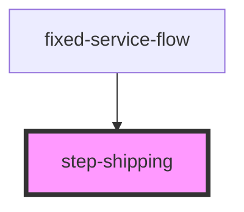

# step-shipping

## Description

Shipping address form component for CLARO HOGAR e-commerce flow. Collects delivery address and contact information for product shipment.

## Features

- Personal information fields (name, email, phone)
- Physical address validation (no PO Box)
- Puerto Rico zip code validation with auto-fill city
- Phone number formatting
- Authorize another person to receive delivery
- Terms and conditions acceptance
- Return policies acceptance
- Form validation with error messages
- Previous data pre-fill from storage

## Usage

```html
<step-shipping
  onNext={() => goToPayment()}
  onBack={() => goToOrderSummary()}
></step-shipping>
```

## Props

| Property | Type | Description |
|----------|------|-------------|
| `onNext` | `() => void` | Callback when address is saved and user proceeds |
| `onBack` | `() => void` | Callback to return to order summary |

## Form Fields

### Required
- Name (nombre)
- Last name (apellido)
- Email
- Phone (10 digits)
- Address line 1 (physical address only)
- Zip code (valid PR zip)
- Terms acceptance
- Policies acceptance

### Optional
- Phone 2 (alternate)
- Address line 2
- Additional notes/instructions
- Authorized person name and phone

## Validations

- Email: Valid email format
- Phone: 10 digits (formatted as (XXX) XXX-XXXX)
- Address: No PO Box, HC, RR, or Apartado
- Zip code: Must be valid Puerto Rico zip (auto-fills city)

## API Endpoints Used

- `POST api/Address/create` - Create shipping address

## Session Storage Keys

- `shipmentId` - ID returned after address creation
- `zipCode` - Zip code
- `shippingAddress` - Full address object

<!-- Auto Generated Below -->


## Properties

| Property | Attribute | Description | Type         | Default     |
| -------- | --------- | ----------- | ------------ | ----------- |
| `onBack` | --        |             | `() => void` | `undefined` |
| `onNext` | --        |             | `() => void` | `undefined` |


## Dependencies

### Used by

 - [fixed-service-flow](../../fixed-service-flow)

### Graph


----------------------------------------------

*Built with [StencilJS](https://stenciljs.com/)*
