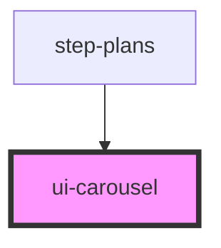

# ui-carousel

<!-- Auto Generated Below -->

## Properties

| Property         | Attribute         | Description                                                            | Type                   | Default                                                                                                                                                                    |
| ---------------- | ----------------- | ---------------------------------------------------------------------- | ---------------------- | -------------------------------------------------------------------------------------------------------------------------------------------------------------------------- |
| `autoplay`       | `autoplay`        | Auto-play interval in milliseconds (0 = disabled)                      | `number`               | `0`                                                                                                                                                                        |
| `breakpoints`    | --                | Responsive breakpoints Default: mobile=1, tablet=2, desktop=3, large=4 | `CarouselBreakpoint[]` | `[     { minWidth: 0, slidesPerView: 1 },     { minWidth: 600, slidesPerView: 2 },     { minWidth: 900, slidesPerView: 3 },     { minWidth: 1200, slidesPerView: 4 },   ]` |
| `gap`            | `gap`             | Gap between slides in pixels                                           | `number`               | `16`                                                                                                                                                                       |
| `loop`           | `loop`            | Enable loop/circular mode                                              | `boolean`              | `false`                                                                                                                                                                    |
| `showNavigation` | `show-navigation` | Show navigation arrows                                                 | `boolean`              | `true`                                                                                                                                                                     |
| `showPagination` | `show-pagination` | Show pagination dots                                                   | `boolean`              | `true`                                                                                                                                                                     |
| `slidesPerView`  | `slides-per-view` | Default number of slides per view                                      | `number`               | `1`                                                                                                                                                                        |
| `totalItems`     | `total-items`     | Total number of items in the carousel                                  | `number`               | `0`                                                                                                                                                                        |

## Dependencies

### Used by

 - [step-plans](../../steps/step-plans)

### Graph

----------------------------------------------

*Built with [StencilJS](https://stenciljs.com/)*
