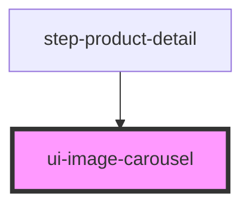

# ui-image-carousel

<!-- Auto Generated Below -->

## Properties

| Property           | Attribute           | Description                                       | Type       | Default |
| ------------------ | ------------------- | ------------------------------------------------- | ---------- | ------- |
| `autoplayInterval` | `autoplay-interval` | Auto-play interval in milliseconds (0 = disabled) | `number`   | `0`     |
| `fallbackImage`    | `fallback-image`    | Fallback image URL when image fails to load       | `string`   | `''`    |
| `images`           | --                  | Array of image URLs to display                    | `string[]` | `[]`    |
| `loop`             | `loop`              | Enable circular/loop mode                         | `boolean`  | `true`  |
| `showIndicators`   | `show-indicators`   | Show indicator dots                               | `boolean`  | `true`  |
| `showNavigation`   | `show-navigation`   | Show navigation arrows                            | `boolean`  | `true`  |

## Dependencies

### Used by

 - [step-product-detail](../../steps/step-product-detail)

### Graph

----------------------------------------------

*Built with [StencilJS](https://stenciljs.com/)*
