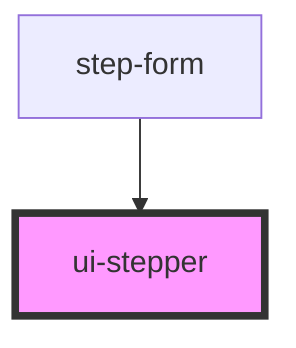

# ui-stepper

<!-- Auto Generated Below -->

## Properties

| Property      | Attribute      | Description                     | Type           | Default |
| ------------- | -------------- | ------------------------------- | -------------- | ------- |
| `currentStep` | `current-step` | Current active step (1-indexed) | `number`       | `1`     |
| `size`        | `size`         | Size variant                    | `"md" \| "sm"` | `'md'`  |
| `steps`       | --             | Array of step items with labels | `StepItem[]`   | `[]`    |

## Dependencies

### Used by

 - [step-form](../../steps/step-form)

### Graph

----------------------------------------------

*Built with [StencilJS](https://stenciljs.com/)*
